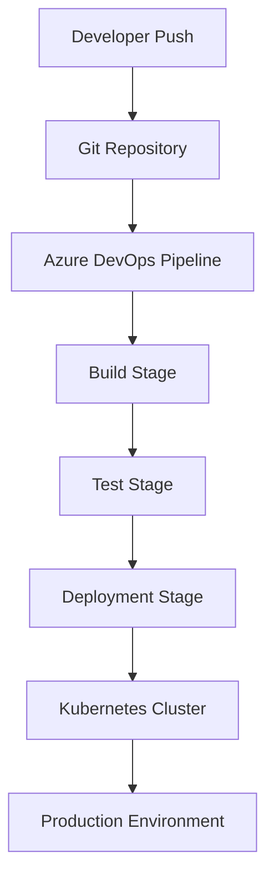

# CI/CD Pipeline Configuration

[Return to main page](../README.MD)

## Overview

The CI/CD pipeline is configured using **Azure DevOps Pipelines**. The pipeline automatically builds, tests, and deploys the application to the Kubernetes cluster.

## Pipeline Stages

1. **Source Code Management**:
    - Code is stored in a Git repository.
    - Commits trigger pipeline runs.

2. **Build Stage**:
    - Compile the .NET backend.
    - Build the React frontend.
    - Build Docker images for each service.

3. **Test Stage**:
    - Run unit tests for both frontend and backend.
    - Run integration tests.
    - Execute end-to-end tests (if available).

4. **Deployment Stage**:
    - Deploy Docker images to the Kubernetes cluster.
    - Automated rollback is triggered if deployment tests fail.

## Pipeline Diagram

## Future Enhancements

- Fully automated rollback.
- Automated performance testing as part of the pipeline.
- Integration with monitoring and alerting systems.

