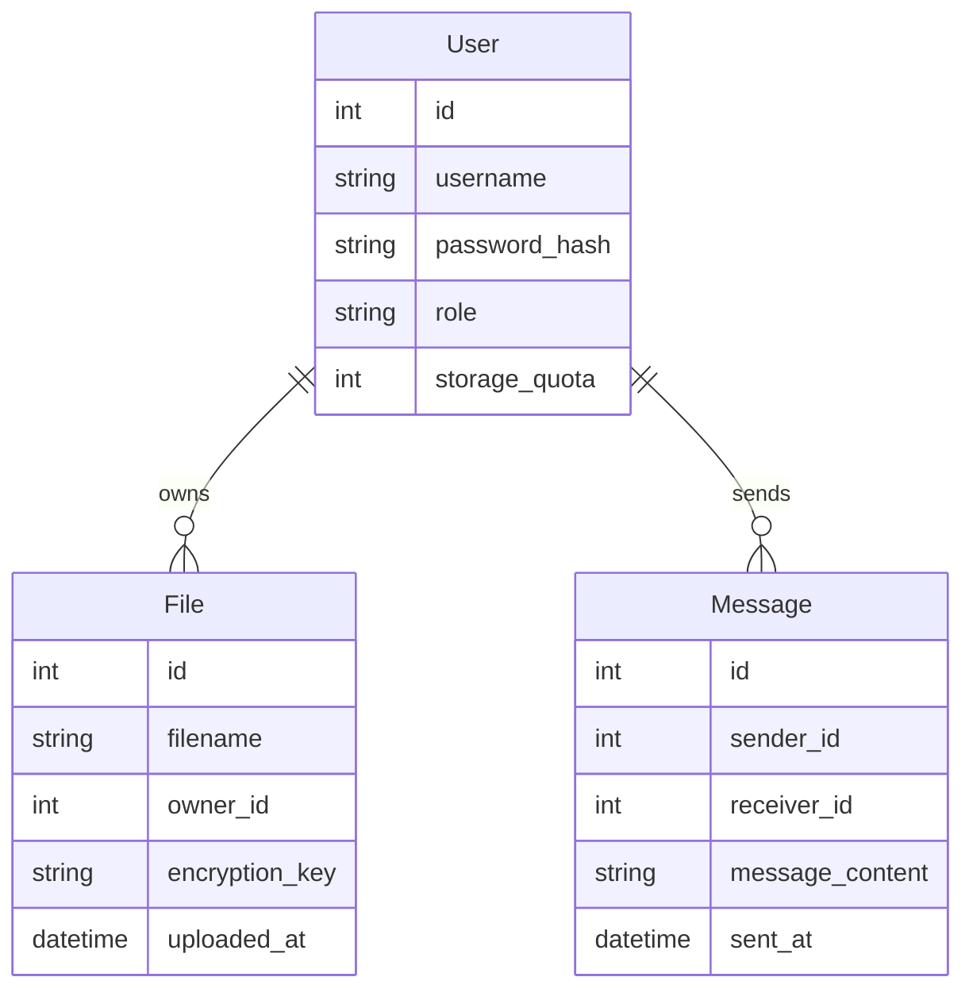

# Database Documentation

[Return to main page](../README.MD)

## Schema Overview

## Tables
### Users
- `id` (Primary Key)
- `username` (Unique)
- `password_hash`
- `role` (One role per user)
- `storage_quota` (Per-user storage limit)

### Files
- `id` (Primary Key)
- `filename`
- `owner_id` (Foreign Key -> Users)
- `encryption_key` (Per-file encryption)
- `uploaded_at` (Timestamp)

### Messages
- `id` (Primary Key)
- `sender_id` (Foreign Key -> Users)
- `receiver_id` (Foreign Key -> Users)
- `message_content`
- `sent_at` (Timestamp)
