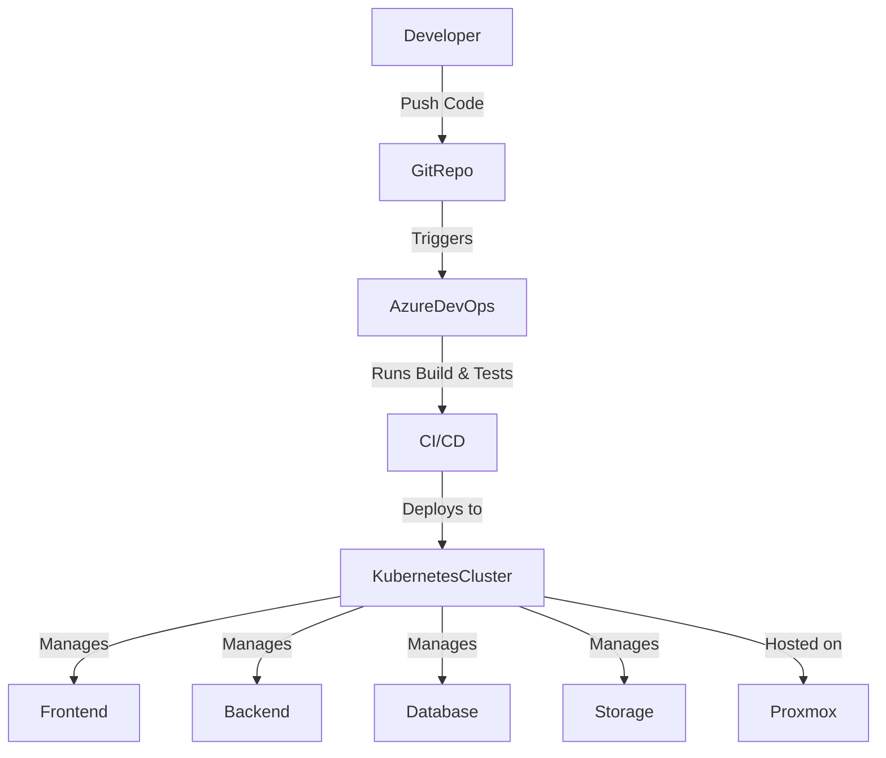

# Deployment Architecture

[Return to main page](../README.MD)

## Overview

The system is deployed using **Docker containers** orchestrated by **Kubernetes**. Initially, Kubernetes runs on an Ubuntu Server VM hosted on Proxmox. Future plans include moving Kubernetes directly onto Proxmox for improved resource utilization.

## Deployment Diagram

## Components
- **Frontend:** React application served via Nginx.
- **Backend:** ASP.NET Core API.
- **Database:** PostgreSQL running as a stateful set.
- **Storage:** CephFS for file storage.
- **CI/CD:** Azure DevOps Pipelines for automated builds, tests, and deployments.
- **Rollback Strategy:** Automated rollback configured in the pipeline on failure.