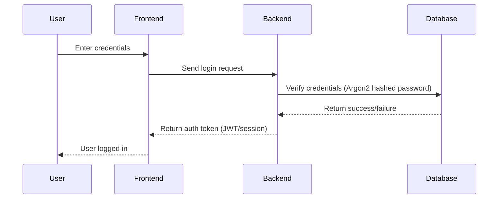
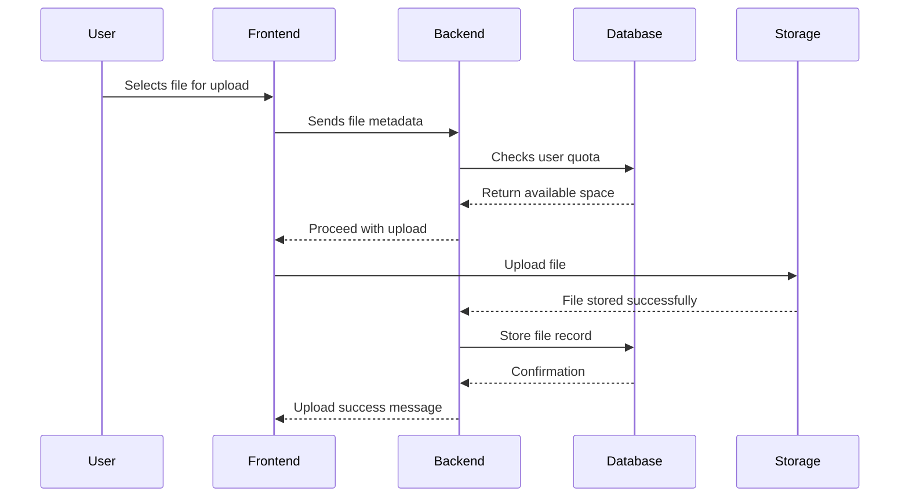

# Sequence Diagrams

[Return to main page](../README.MD)

## User Authentication Flow

```mermaid
sequenceDiagram
    participant User
    participant Frontend
    participant Backend
    participant Database

    User->>Frontend: Enter credentials
    Frontend->>Backend: Send login request
    Backend->>Database: Verify credentials (Argon2 hashed password)
    Database-->>Backend: Return success/failure
    Backend-->>Frontend: Return auth token (JWT/session)
    Frontend-->>User: User logged in
```

## File Upload Flow

```mermaid
sequenceDiagram
    participant User
    participant Frontend
    participant Backend
    participant Database
    participant Storage

    User->>Frontend: Selects file for upload
    Frontend->>Backend: Sends file metadata
    Backend->>Database: Checks user quota
    Database-->>Backend: Return available space
    Backend-->>Frontend: Proceed with upload
    Frontend->>Storage: Upload file
    Storage-->>Backend: File stored successfully
    Backend->>Database: Store file record
    Database-->>Backend: Confirmation
    Backend-->>Frontend: Upload success message
```