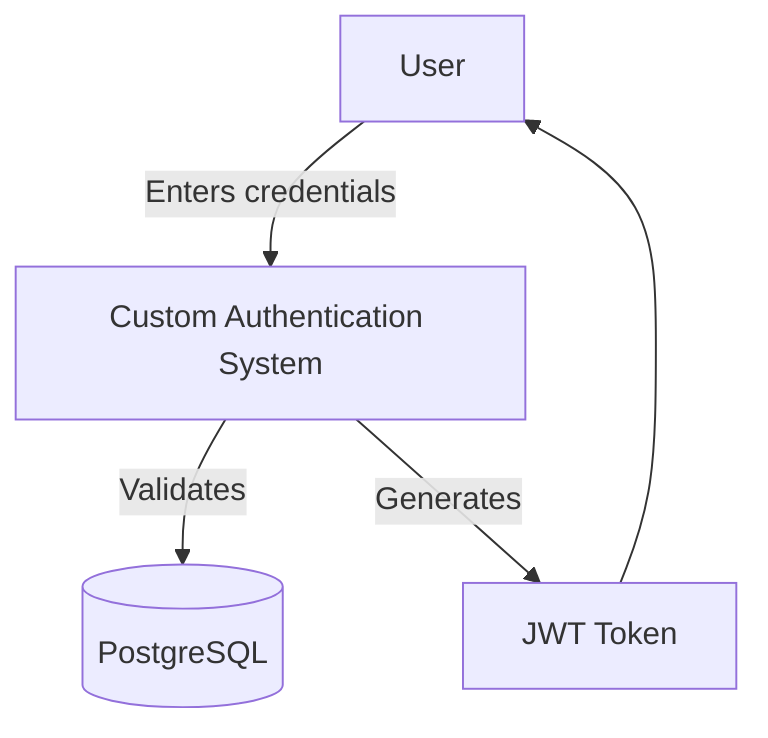
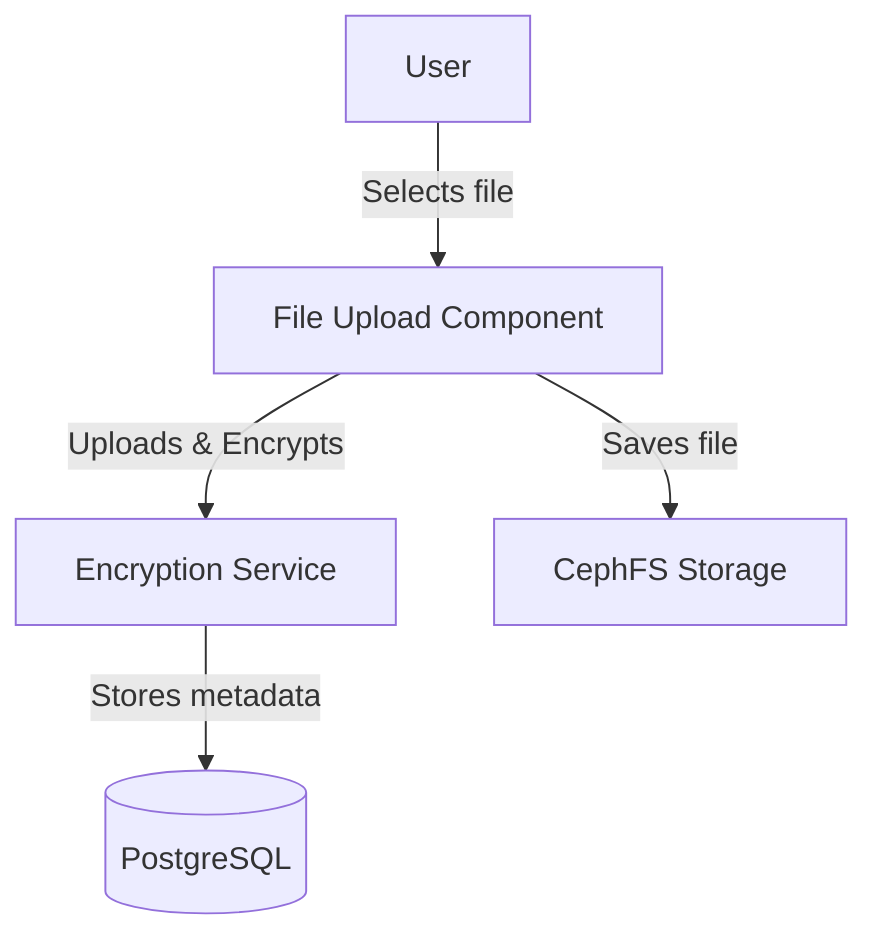
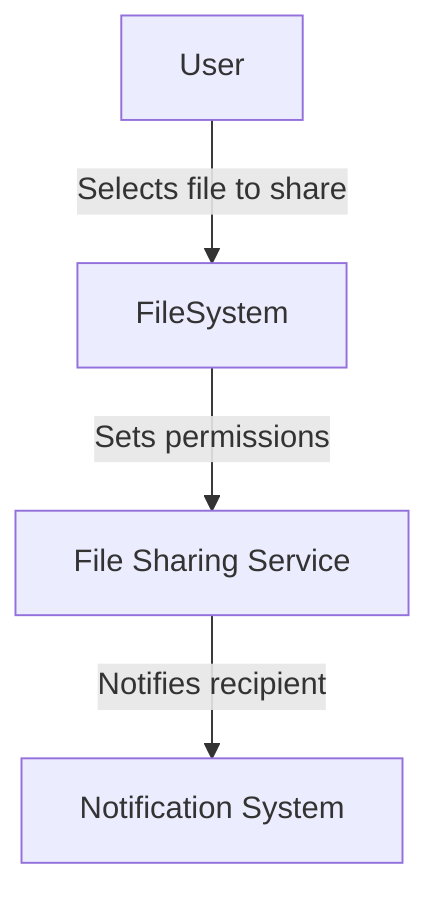
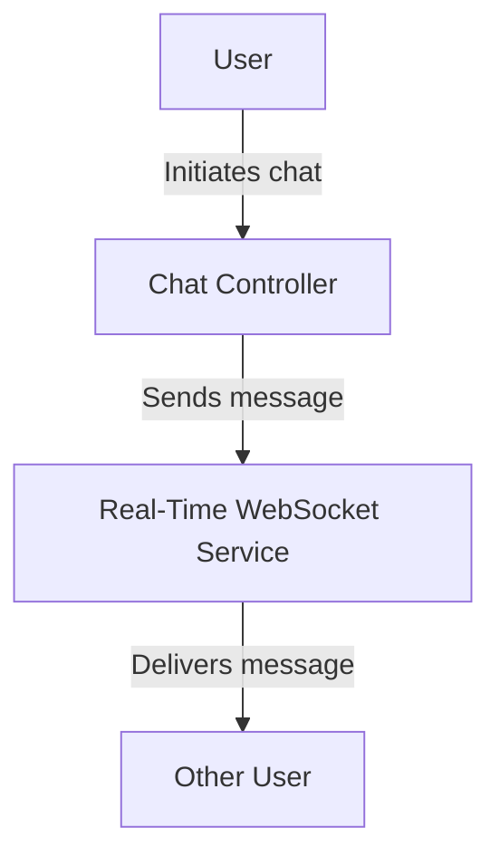
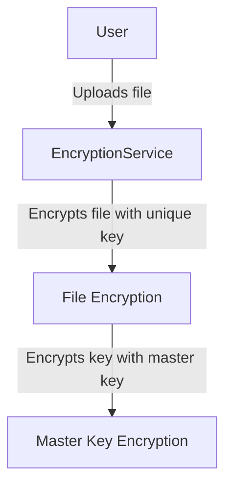
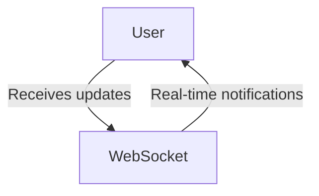
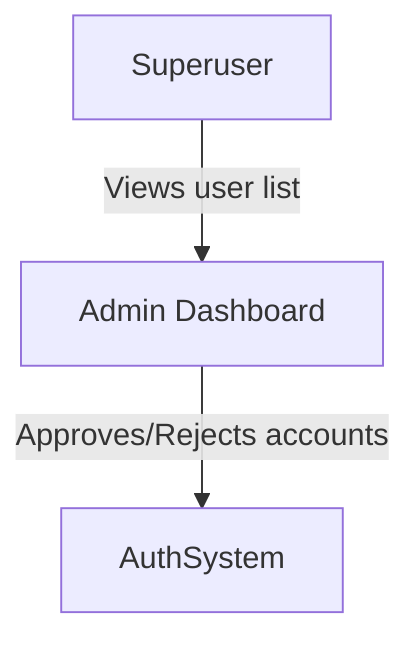
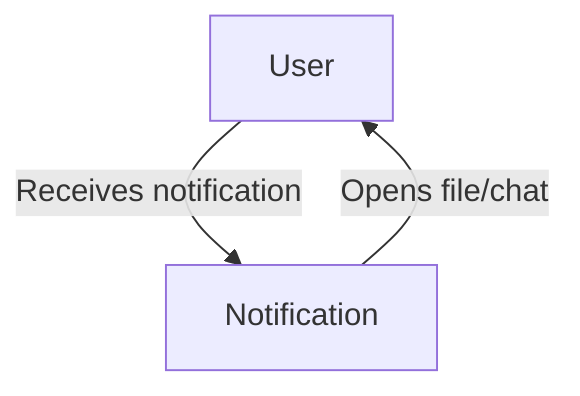
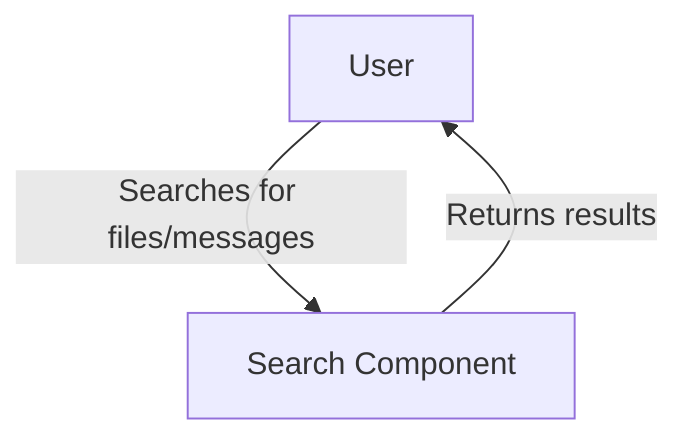
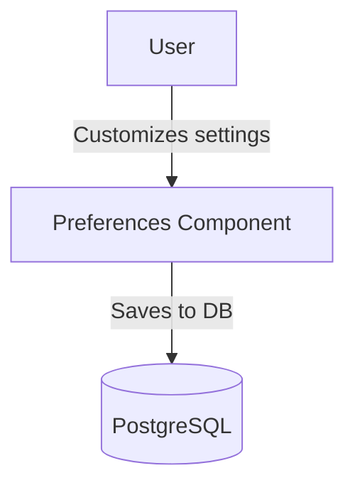

# Use Case Diagrams

[Return to main page](../README.MD)

## User Authentication Use Case

## File Management Use Case

## File Sharing Use Case

## Chat Functionality Use Case

## Security Use Case

## Real-Time Updates Use Case

## User Management Use Case

## Notification Use Case

## Search Functionality Use Case

## User Preferences Use Case
